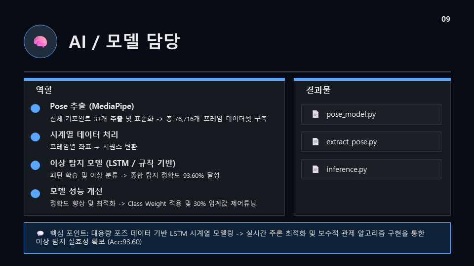
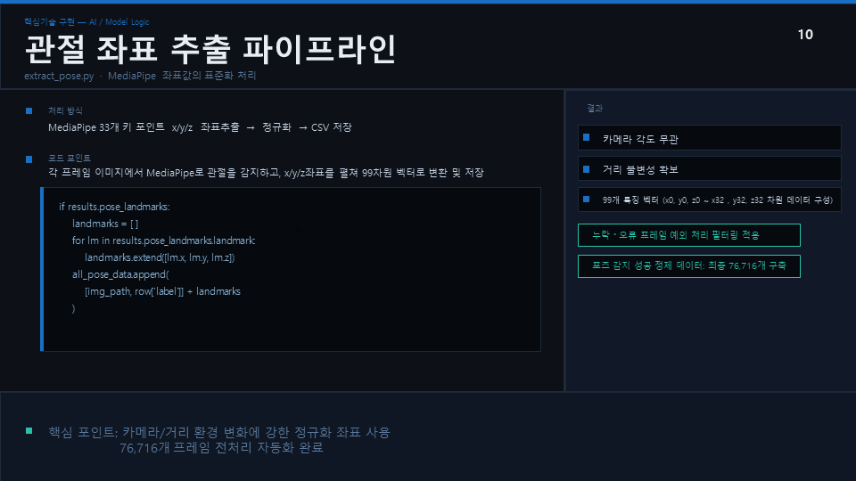
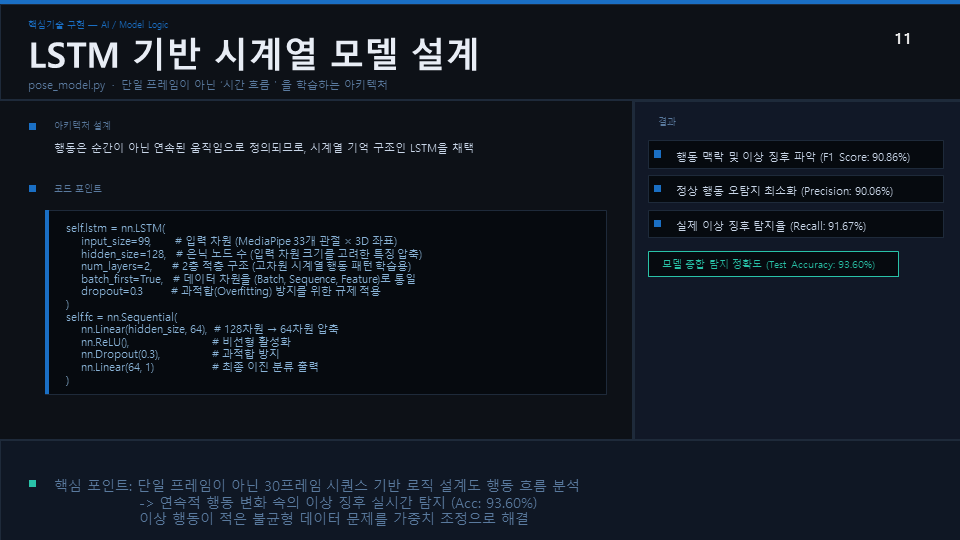
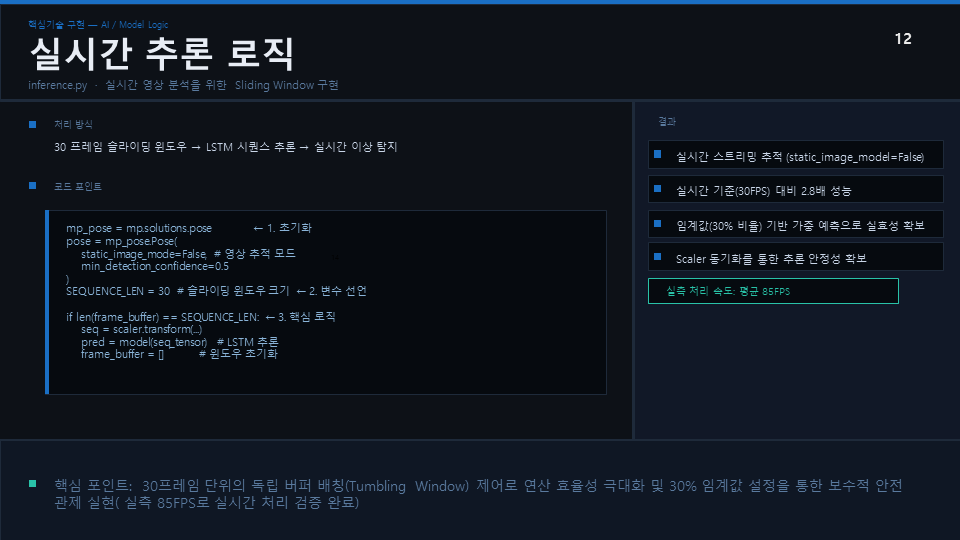

# behavior-detection
# 👁️ behavior-detection

MediaPipe와 LSTM 기반의 실시간 포즈 추출 및 이상 행동 감지 시스템에서 **AI / 모델링 파트**를 전담하여 개발한 저장소입니다.

---

## 💻 담당 핵심 기능 및 구현 내용

### 1. AI / 모델 담당 역할 및 결과물 개요

* **대용량 포즈 데이터 처리:** 76,716개 프레임 데이터셋 구축 및 시퀀스 변환
* **모델 성능 최적화:** Class Weight 적용 및 30% 임계값 제어 튜닝을 통한 종합 탐지 정확도 **93.60%** 달성

### 2. 관절 좌표 추출 파이프라인 (`extract_pose.py`)

* **MediaPipe 활용:** 신체 33개 키 포인트의 $x, y, z$ 좌표를 추출하여 99차원 벡터 데이터로 변환
* **데이터 정제:** 누락 및 오류 프레임 예외 처리 필터링을 적용하여 카메라 각도와 거리에 강인한 정규화 좌표 사용

### 3. LSTM 기반 시계열 모델 설계 (`pose_model.py`)

* **연속적 행동 흐름 분석:** 단일 프레임이 아닌 30프레임 시퀀스 기반의 LSTM 아키텍처 채택
* **불균형 데이터 해결:** 이상 행동 데이터가 적은 문제를 가중치 조정(Class Weight)으로 해결 (F1-Score: 90.86%, Recall: 91.67%)

### 4. 실시간 추론 로직 구현 (`inference.py`)

* **Sliding Window 알고리즘:** 30프레임 단위의 독립 버퍼 배칭(Tumbling Window) 제어로 연산 효율성 극대화
* **실시간 성능 검증:** 실측 **85 FPS**를 기록하며 실시간 스트리밍 환경에서 안정적인 이상 징후 탐지 가능
